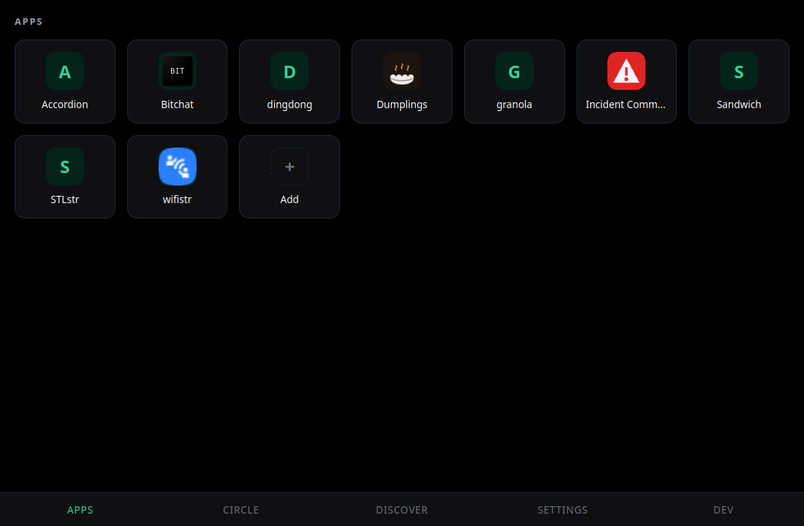
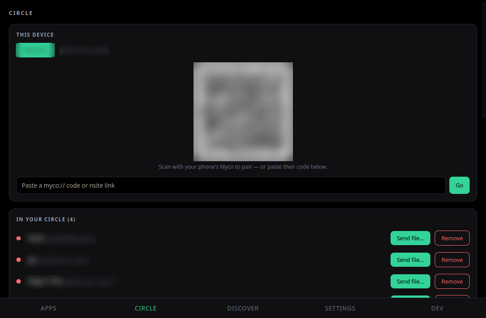
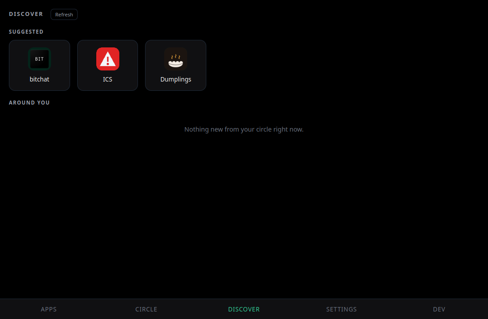
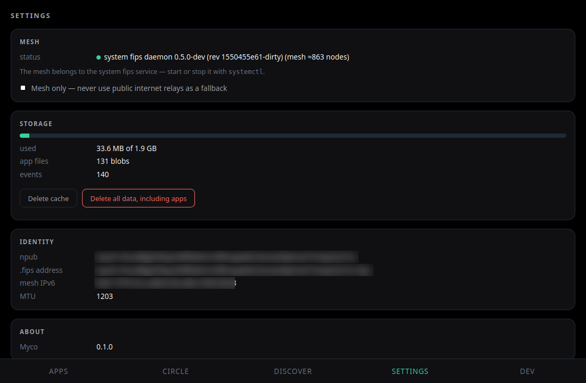

# Myco Desktop

> **Install apps from the people around you** — over a local mesh, with no
> internet and no app store. On your computer.

Myco Desktop is a Linux-first desktop client for **nsites** — self-contained web
apps published on Nostr — and **napplets** — sandboxed programs with a
permission model — shared peer-to-peer over a [FIPS](https://github.com/jmcorgan/fips)
mesh (Bluetooth LE, Wi-Fi/LAN UDP). Pair with someone, and their apps land in
your grid, each opening full-screen in its own window — online or fully offline.



## Where this comes from

**This is the desktop edition of [Myco](https://github.com/Origami74/myco) — the
offline-first Android app by [@Origami74](https://github.com/Origami74).** The
Android app is the original and the source of truth for the protocol, the
concepts, and the content engine; this repository is a Tauri desktop shell built
around the very same **`myco-core`** Rust crate (linked directly, no FFI), so a
laptop is a first-class peer on the same mesh as the phones.

- **The app, the mesh, the concepts** → [Origami74/myco](https://github.com/Origami74/myco)
  (start with its [concepts & glossary](https://github.com/Origami74/myco/blob/main/docs/design/core/concepts.md))
- **The mesh transport** → [FIPS](https://github.com/jmcorgan/fips) (embedded here,
  or a system daemon)
- **This desktop shell** → [`desktop/`](desktop/), designed in
  [`docs/design/desktop.md`](docs/design/desktop.md)

## What it does

The desktop mirrors the Android feature set — the same five surfaces, driven by
the same core:

| | |
| :-- | :-- |
|  | **Circle** — pair with a phone by showing a QR code (or pasting a `myco://` code), see who's in your circle, and **send files** to any paired peer over the mesh, with consent on the other end. |
|  | **Discover** — a suggested set of public nsites and napplets (Mappy, Minesweeper, DingDong), plus whatever the peers in your circle are carrying right now. A tap on a napplet fetches it and opens install review; nothing is granted until you say so. |
|  | **Settings** — which mesh backend is running (system daemon or embedded node), storage usage and wipes, an offline-only switch, **App reach** (how far apps may send and look over the mesh, in hops), and your device identity. |

- **Apps** — every installed nsite and napplet as a tile; each opens chrome-less
  in its own window. Nsites are served from a loopback gateway exactly as on the
  phone. Napplets (marked 🦆) run sandboxed inside the same trusted shell page
  the phone uses, with no network of their own: everything they do goes through
  capabilities Myco implements. Install review shows what a napplet will be able
  to do before anything is granted; right-click for **Manage permissions**
  (live switches per capability), **Reload app**, **Share** (a QR the phone
  scans to pair with you and fetch the app), and **Add to launcher**. Paste an
  `naddr` into *Add* to fetch one by hand.
- **Dev** — peer diagnostics: every path the mesh holds to a peer (lane, state,
  RTT, ETX, score) with the active lane and standbys on the row, connect
  history, and a speed test.

## Mesh backends

The shell links `myco-core` directly and picks a backend at startup:

- **Daemon mode** (default when a system fips daemon answers) — talk to the
  running daemon over its control socket; the mesh lifecycle belongs to systemd.
  Two one-time daemon settings make a phone reachable: open Myco's ports in the
  daemon's mesh firewall (`sudo cp desktop/packaging/myco.nft /etc/fips/fips.d/
  && sudo nft -f /etc/fips/fips.nft` — without it a pair request is silently
  dropped) and, for same-Wi-Fi pairing, `node.rendezvous.lan.enabled: true` in
  `/etc/fips/fips.yaml`.
- **Embedded mode** (fallback) — an in-process fips node like the phone: its own
  BLE, LAN UDP, and `fips0` TUN. One-time `sudo desktop/packaging/myco-setup`
  grants the TUN capability and wires `.fips` name resolution.

Details: [`docs/design/desktop.md`](docs/design/desktop.md).

## Download

Grab the latest `.deb` or AppImage from the
[**Releases**](https://github.com/fr34aky/myco-desktop/releases) page (Linux
x86-64). macOS and Windows builds are planned.

```sh
# Debian/Ubuntu
sudo apt install ./Myco_*_amd64.deb

# or run the self-contained AppImage
chmod +x Myco_*_amd64.AppImage && ./Myco_*_amd64.AppImage
```

On a machine with NVIDIA's own driver, 0.2.0 and earlier abort at launch with
`Could not create GBM EGL display`. Start those versions with
`WEBKIT_DISABLE_DMABUF_RENDERER=1` in the environment; builds after 0.2.0 set it
themselves.

## Build from source

The workspace needs a local [fips](https://github.com/jmcorgan/fips) checkout at
`reference/fips` (a gitignored path dependency — see
[`docs/how-to/build.md`](docs/how-to/build.md) §4) plus the webkit2gtk/gtk3 dev
packages:

```sh
sudo apt install -y pkg-config libdbus-1-dev libclang-dev \
  libwebkit2gtk-4.1-dev libgtk-3-dev librsvg2-dev \
  libayatana-appindicator3-dev libsoup-3.0-dev

cargo build -p myco-desktop
./target/debug/myco-desktop

# bundle a .deb + AppImage:
cargo tauri build   # from desktop/src-tauri
```

Embedded mode needs the one-time capability grant (and again after each rebuild,
since file capabilities die with the inode):

```sh
sudo desktop/packaging/myco-setup ./target/debug/myco-desktop
```

## Platforms

- **Linux (x86-64)** — built today (`.deb` + AppImage).
- **macOS / Windows** — planned. Tauri produces `.dmg` / `.msi` from the same
  `cargo tauri build`; the release workflow is already structured for a runner
  matrix.

## License

[MIT](LICENSE). Myco Desktop bundles `myco-core` from
[Origami74/myco](https://github.com/Origami74/myco) and the
[FIPS](https://github.com/jmcorgan/fips) mesh; see those projects for their terms.
